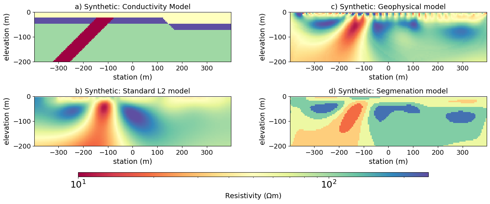
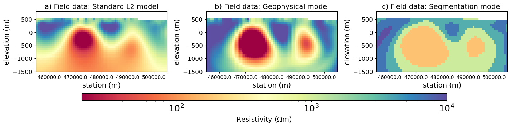

**Applying Segmentation Methods In Geophysical Inversion to Improve The
Recovery of Structural Features**

Johnathan C. Kuttai\* Lindsey J. Heagy

*University of British Columbia University of British Columbia*

*Vancouver, BC V6T 1Z4 Vancouver, BC V6T 1Z4*

*jkutt@eoas.ubc.ca lheagy@eoas.ubc.ca*

**SUMMARY**

Geophysical inversions produce physical property models that are
interpreted to provide geologic information. In this work, we leverage
segmentation methods to promote the recovery of geologic structures in
the inversion. The segmentation is incorporated into the inversion by
adding a regularized segmentation as terms to the objective function.
The Alternating Direction Method of Multipliers (ADMM) is used to solve
the optimization problem. To demonstrate our approach, we present a
synthetic DC resistivity example and an inversion of field MT data.

**Key words:** Segmentation, geophysical inversion, physical properties,
ADMM

**INTRODUCTION**

Geophysicists interpret inversion models and communicate the results to
non-geophysicists who make exploration decisions. We hope to answer
geologists\' questions about the structural dip or where to expect to
hit the mineralized zone. These questions can be challenging because
geophysical inversions are non-unique and ill-posed. To approach this
non-uniqueness, deterministic inversion approaches minimize an objective
function consisting of a data misfit and model regularization term. The
model regularization is often a combination of a smallness term that
penalizes distance from a reference model, and a smoothness term that
penalizes spatial gradients in the model. Within this framework, there
are multiple approaches for incorporating prior information and
producing inversion results that are more indicative of typical geologic
structures. A-priori structural information about a target\'s dip and
orientation can be incorporated into the inversion by rotating
derivatives in the smoothness term (Li & Oldenburg, 2000). Other methods
promote clustering of the physical properties during the inversion, for
example, Fuzzy c-means (Sun & Li, 2017) or the Petrophysically and
Geologically guided Geophysical Inversion (Astic & Oldenburg, 2020).
These approaches require that the user specify the number of rock units
to be used in the clustering. In this work, we are motivated to explore
how image segmentation can be used to improve the recovery of geologic
features and to do so without having to specify the number of expected
classes.

The work presented here builds upon previous work in which we developed
an automated approach for inferring structural information during the
inversion and incorporating this into the model regularization (Kuttai &
Heagy, 2024). In our previous work, we used a pre-trained transformer
network, SAM (Kirillov et al., 2023), to perform image segmentation on
the physical property model at a given iteration of the inversion and
determine the primary orientation of each unit. The orientation
information was then incorporated into the smoothness term of the
regularization using the rotated-gradient approach of Li & Oldenburg
(2000). We were using the segmentation only to infer orientations;
however, this becomes limiting when structures are complex. In this
work, we aim to include the segmentation directly into the inversion
framework. To do so, we modify the statement of the inverse problem by
adding a regularized segmentation to the objective function. We then use
Alternating Direction Method of Multipliers (ADMM) to solve the
optimization problem (Boyd et al., 2010). ADMM breaks the problem into
three steps: (1) a standard geophysical model update, (2) updating the
segmentation, and (3) updating the constraint error term that connects
the geophysical and segmentation update.

Related work by Ravasi and Birnie (2023) adapts the inverse problem to
include a segmentation term in the objective function for seismic
inversions. This work requires that the number of classes be predefined
and held constant throughout the inversion. We extend the method by
allowing the number of classes for the segmentation term to be adaptive
and vary from iteration to iteration. We achieve this using the adaptive
Gaussians technique from 3D image reconstruction methods like Gaussian
splatting (Kerbl et al., 2023). Our approach has the benefit that it
produces a segmented model through the inversion, which may aid geologic
interpretation. We illustrate that our approach improves the recovery of
geologic structures using two examples. The first is a synthetic direct
current (DC) resistivity example, and the second uses magnetotelluric
(MT) data from the Athabasca basin of Saskatchewan, Canada.

**METHOD AND RESULTS**

To incorporate segmentation into the inversion, we adapt the statement
of the inverse problem to include two terms in addition to the usual
data misfit ($\phi_{d}$) and model regularization ($\phi_{\text{smooth}}$). Our
approach is similar to Ravasi and Birnie (2023) except that we use a
smoothness regularization on the physical property model instead of
another total variation regularization. The first term that we add is
$\phi_{seg}$ which promotes the recovery of a physical property model
that is close to the segmented model. The second term that we add,
$\phi_{z}\ ,$ is a regularization on the segmentation itself. Our
statement of the inverse problem is

$$\mathsf{m,\ Z\  = \ }\text{minimize}\ \phi_{d}\mathsf{(m)\  + \ }\beta\phi_{\text{smooth}}\mathsf{(m)\  + \ }\gamma\phi_{\text{seg}}\mathsf{(m,Z)\  + \ }\eta\phi_{z}\mathsf{(Z)\ \ }$$

$$s.t.\ m_{i}\mathsf{= c\lbrack}\text{argmax}(z_{i})\rbrack\ \ for\ i\  = \ 1,\ ...,\ N_{\text{cells}}$$

where **m** is the physical property model vector, **Z** is a matrix of
probabilities with each column containing the probability that a cell
belongs to a class $c_{j}$ in **c,** and its shape is the number of
cells by the number of classes ($N_{\text{cells}}$ by $N_{\text{classes}}$). The
vector **c** contains the classes, and its values are the mean of the
physical properties of the cells associated with that class.
$\beta,\ \gamma,\ \eta\ $are the trade-off parameters for each
regularization term in the objective function. The first term of our
objective function is the data misfit:

$$\phi_{d}\mathsf{(m)\  = ||}F(\mathsf{m)\  - \ }\mathsf{d}_{obs}||^{2}$$

where $F(\mathsf{m}$) is the forward model operator and
$\mathsf{d}_{obs}$is the observed data. The model regularization, if we
choose to use one, is an L2 norm of the spatial derivatives of the
model:

$$\phi_{\text{smooth}}\mathsf{(m)\  = \ ||}\mathsf{W}_{m}\mathsf{m|}|^{2}$$

Here $\mathsf{W}_{m}$ is a matrix containing the finite difference
stencil and the $\alpha_{x,y,z}$ multipliers that weight the smoothness
term in each direction. The segmentation norm, which promotes similarity
between the physical property of each cell and the class to which it is
most closely associated, is represented by:

$$\phi_{\text{seg}} = \ \sum_{i = 1}^{N_{\text{cells}}}\ \sum_{j = 1}^{N_{\text{classes}}}\ z_{ij}(m_{i}\  - \ c_{j})^{2}$$

where $z_{ij}$ is a probability element of matrix **Z**, and $c_{j}$ is
the mean physical property of all cells belonging to that class. The
nuance we add is that the number of classes is dynamically set. This
allows for the classes to change at each iteration, adaptively. To
achieve this, we use adaptive Gaussians that fit multiple Gaussians to
the input model and add or merge the number of Gaussians that fit the
input given splitting and merging thresholds. To regularize the
segmentation, we use total variation regularization on each column of
the matrix **Z** and then sum them. This controls how smooth or sharp
the resulting segmentation is. We represent the total variation term as:

$$\phi_{Z}\mathsf{(Z)\  = \ }\sum_{j = 1}^{N_{\text{classes}}}\ |\nabla\mathsf{Z}_{j}|$$

The objective function is now a complex optimization problem to
minimize. ADMM lets us break up the problem and treat the data misfit
and segmentation components separately. It then links both components
with a coupling term. The full Lagrangian for our ADMM setup is:

$\mathcal{L(}\mathbf{m,\ Z,\ }\mathsf{u}\mathbf{)\  =}||F(\mathsf{m)\  - \ }\mathsf{d}_{obs}||^{2} + \beta||\mathsf{W}_{m}\mathsf{m|}|^{2} + \gamma\sum_{i = 1}^{N_{cells}}\ \sum_{j = 1}^{N_{c}}\ z_{ij}(m_{i}\  - \ c_{j})^{2} + \eta\ \sum_{j = 1}^{N_{\text{classes}}}\ |\nabla\mathsf{Z}_{j}| + \lambda||\mathsf{m\  - \ s + u|}|^{2}$

where **s** is the segmentation model that has elements $s_{i}$ =
$\mathsf{c\lbrack}\text{argmax}(z_{i})\rbrack$ for
$i\  = \ 1,\ ...,\ N_{\text{cells}}$. The last term is the running constraint
violation estimates; the difference between **m** and **s** at each
iteration is summed cumulatively and stored in the vector **u**. The
solution to the optimization problem using ADMM operates in 3 steps, as
described by Boyd et al. (2010). First, we update the model according to

$$\mathsf{m}^{k + 1}\  = \text{minimize}\ ||F(\mathsf{m)\  - \ }\mathsf{d}_{obs}||^{2} + \beta||\mathsf{W}_{m}\mathsf{m|}|^{2} + \gamma\sum_{i = 1}^{N_{cells}}\ \sum_{j = 1}^{N_{c}}\ z_{ij}(m_{i}\  - \ c_{j})^{2} + \lambda||\mathsf{m\  - \ s + u|}|^{2}$$

and **Z**, **u** are held constant. Then we update the segmentation

$$\mathsf{Z}^{k + 1}\  = \ \text{minimize}\ \gamma\sum_{i = 1}^{N_{cells}}\ \sum_{j = 1}^{N_{c}}\ z_{ij}({m_{i}}^{k + 1}\  - \ c_{j})^{2} + \eta\ \sum_{j = 1}^{N_{classes}}\ |\nabla\mathsf{Z}_{j}| + \lambda||\mathsf{m}^{k + 1}\mathsf{\  - \ s + u|}|^{2}$$

and **m, u** are held constant. Then, the errors are updated:

$$\mathsf{u}^{k + 1} = \mathsf{u}^{k} + \mathsf{m}^{k + 1} - \mathsf{s}^{k + 1} $$

We iterate until we reach a target misfit and then continue to iterate
further until the changes in the constraint are below a set threshold.

To illustrate our approach, we first apply it to a synthetic model. In
this example, we include the smoothness for the **m** update. We
simulate a DC resistivity survey collecting pole-pole and pole-dipole
measurements with parameters a=25m to 250m and n=16. The synthetic model
contains an intrusive dipping conductor and two shallow, horizontal,
faulted layers (Figure 1a). The standard L2 recovered model, shown in
Figure 1b, is smooth, and the dip of the intrusive unit is recovered as
a more steeply dipping feature than it should be. The geophysical model
recovered using the segmentation approach (Figure 1c), resolves the
horizontal layering and improves the dip estimate of the intrusive
conductor. The segmentation model derived from **Z** is shown in Figure
1d, and it captures the geological features rather well. We can see the
two shallow horizontal layers, the intrusive conductor, and we see the
influence of the fault near x=150m as the top layer thickened. There is
also a vertical offset between the most resistive units recovered as the
dark blue units in Figure 1d.

**Figure 1: Recovered model comparison when using segmentation and
standard L2 methods for inversion. The data is a DC-resistivity
simulation over a synthetic conductivity model illustrated in (a). The
standard L2 result is shown in (b), while the recovered geophysical
model with the regularized segmentation added to the objective function
is shown in (c). The auxiliary space Z is used to produce the recovered
segmentation model shown in (d).**

The field example we demonstrate uses magnetotelluric data to target
graphitic conductors that form in the faulted unconformity in the
Athabasca basin of Saskatchewan, Canada. For this example, the
smoothness term for the **m** update is excluded. The standard L2 shown
in Figure 2a indicates two conductors that are not distinctively
defined, and the dip of each is ambiguous. By adding a regularized
segmentation to the objective function as described above, we recover a
geophysical model that has two distinct conductors (Figures 2b). Figure
2c shows the segmentation model derived from matrix **Z** by assigning
each cell the physical property with the highest probability. The two
conductors recovered have been explored extensively, and the conductor
near 521,000m is the P2 conductor, which hosts the McArthur River Mine's
uranium deposits (Tuncer, 2007).

**Figure 2: Recovered model comparison using magnetotelluric field data
targeting dipping basement graphitic conductors. The standard L2
recovered model is shown in (a). The recovered geophysical model output
from ADMM is shown in (b), and the corresponding segmentation model in
(c)**

**CONCLUSIONS**

We have introduced an inversion approach that leverages segmentation
algorithms. Our work incorporates the segmentation into the inversion by
adding a regularized segmentation to the objective function. ADMM
provides a mathematical framework to encode segmentation directly into
the inversion process. However, this approach introduces an additional
term along with hyperparameters that control the influence of
segmentation on the inversion result. Developing reliable strategies for
assigning these values is an avenue for future research. Unlike other
clustering-based inversion methods, our approach does not require
specifying the number of classes beforehand, as this value is
dynamically updated throughout the inversion process. This contribution
provides the tools to recover models that can be more geologically
interpretable. In particular, we show that in the synthetic example, we
are able to distinguish multiple layers and improve the dip estimate of
the intrusive conductive dyke. In the MT field example, we recover two
distinctive, conductive targets that are coincident with the known P2
fault and a second grouping of faults.

**REFERENCES**

Astic, T., Oldenburg, D.W., 2019, A framework for petrophysically and
geologically guided geophysical inversion using a dynamic Gaussian
mixture model prior: Geophysical Journal International, 219, 1989-2012.

Boyd, S., Parikh, N., Chu, E., Peleato B., and Eckstein J., 2011,
Distributed Optimization and Statistical Learning via the Alternating
Direction Method of Multipliers: Foundations and Trends in Machine
Learning, 3, 1--122.

Kirillov, A., Mintun, E., Ravi, N., Mao, H., Rolland, C., Gustafson, L., Xiao, T., Whitehead, S., Berg, A.C., Lo, W.Y., Dollár, P. and Girshick, R. \[2023\] Segment Anything.

Kerbl, B., Kopanas, G., Leimkühler, T., Drettakis, G., 2023, 3D Gaussian
Splatting for Real-Time Radiance Field Rendering.

Kuttai, J.C., Heagy, L.J., 2024, An automated approach to incorporate
structural information into the inversion using image segmentation: EAGE
NS 2024 Abstract.

Li, Y., and Oldenburg D.W., 2000, Incorporating geological dip
information into geophysical inversions: GEOPHYSICS, 65, 148-157.

Ravasi, M., Birnie, C., 2022, A joint inversion-segmentation approach to
assisted seismic interpretation: Geophysical Journal International, 228, 893-912.

Sun, J., Li, Y., 2017, Joint inversion of multiple geophysical and
petrophysical data using generalized fuzzy clustering algorithms:
Geophysical Journal International, 208, Pages 1201--1216

Tuncer, V., 2007, Exploration for Unconformity-Type Uranium Deposits
with Audio-Magnetotelluric Data: A Case Study from the McArthur River
Mine, Saskatchewan, Canada: Masters Thesis, University of Alberta.
